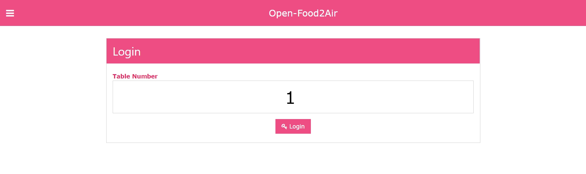
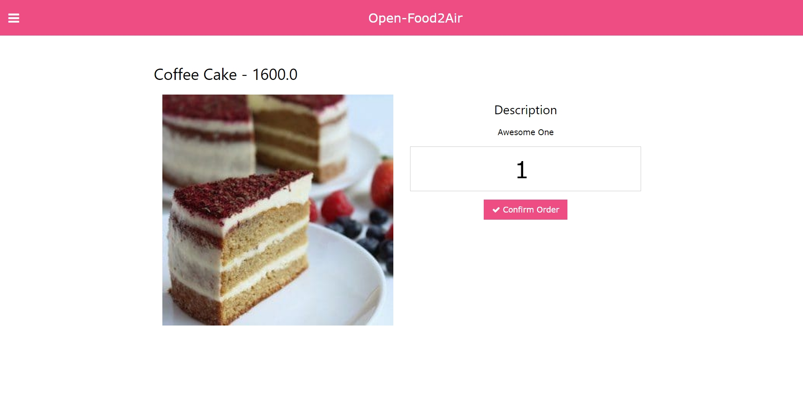
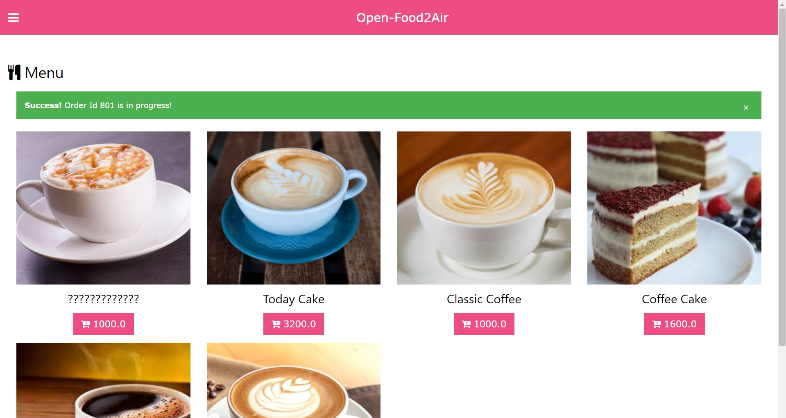
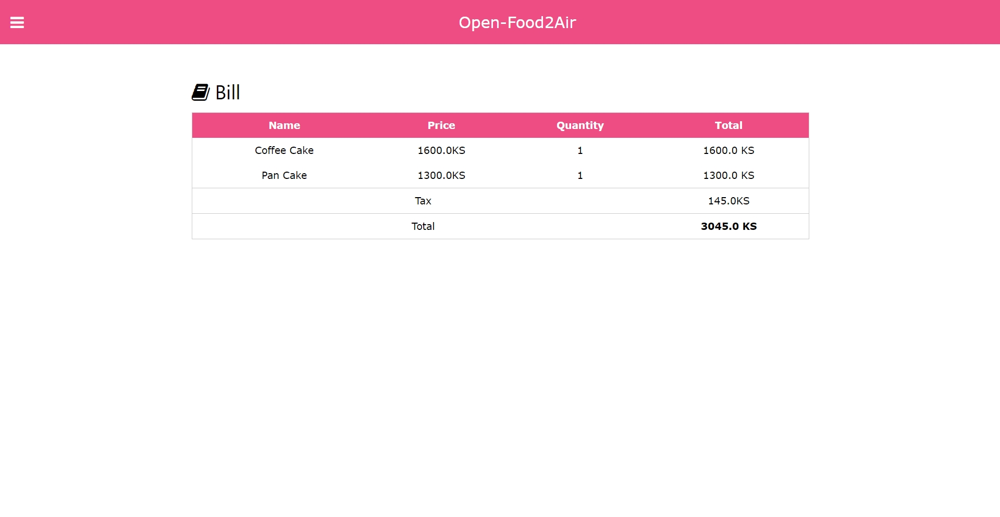
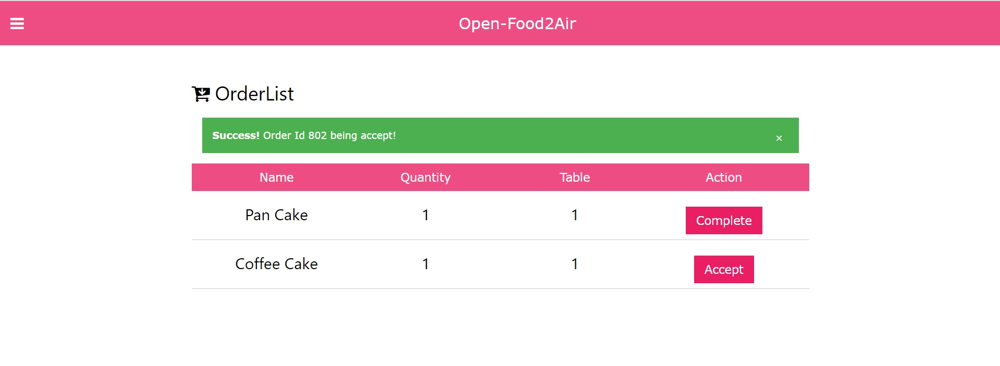
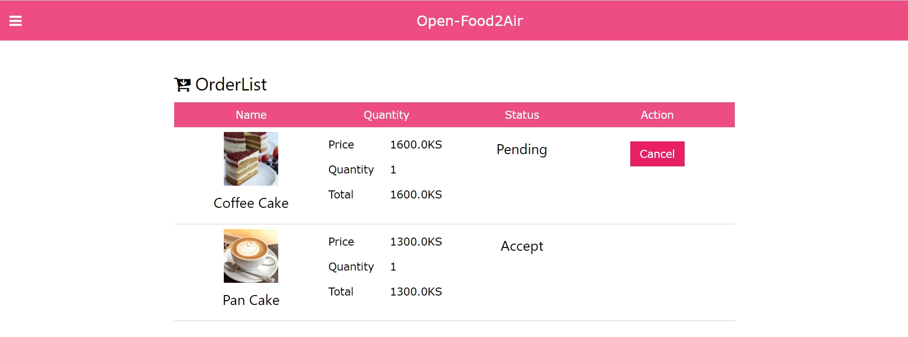
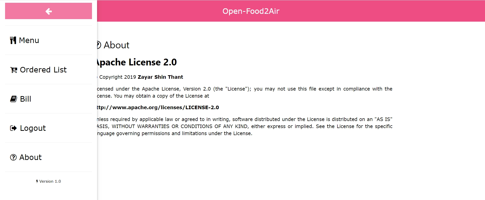

# Open-Food2Air

# About
Open Source Version of Food2Air Restaurant management systems.
This is the open source version of Food2Air Restaurant management systems licined under Apache License Version 2.0.

# Screenshot

# Requirements 

- Tomcat Server 9.0 (Recomandard)

- Apache Server (for Media Server Usage)

- MySql Server

- Eclipse IDE
